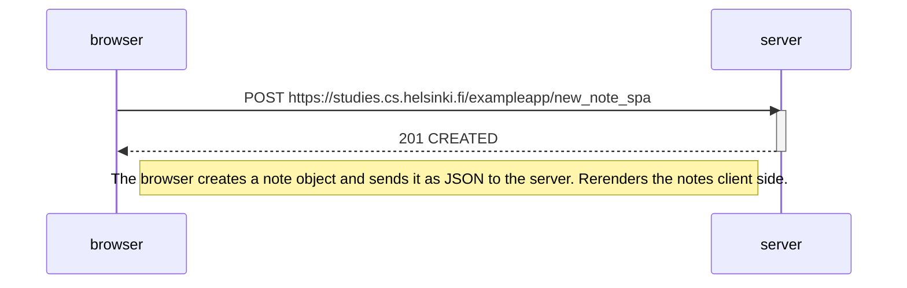

```mermaid

sequenceDiagram
    participant browser
    participant server

    browser->>server: POST https://studies.cs.helsinki.fi/exampleapp/new_note_spa
    activate server
    server-->>browser: 201 CREATED
    deactivate server
    
    Note right of browser: The browser creates a note object and sends it as JSON to the server. Rerenders the notes client side.

```